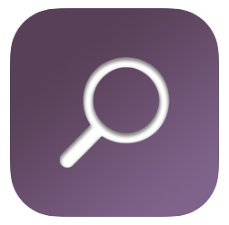

# Lost-Found iOS App


<p align="center">
  
</p>


My Computer Science Final Project. An iOS App for uploading all kind of items you have lost/found. 

App available on the [App Store](https://apps.apple.com/us/app/id1534211046).

## :memo: Description 

This project was developed as my final's degree project, starting on June 2019, with the guidance of a senior iOS developer, from who I could learn (and apply) the newest, and most used patterns and structures (such as MVVM or Coordination Pattern).

NOTE: This is an old, un updated version, many of the functionalities (such as notifications, real-time chat) and UI redesign are not available here. New updated modules will be uploaded soon as the released version gets updated.


### Features

:white_check_mark: "Infinite Scroll" timeline, ordered by distance towards the user.

:white_check_mark: The item info and thumbnails have each a different pagination, to optimize the usage of user's data.

:white_check_mark: The thumbnails, and item's image are cached in device to avoid redownloading (props to Kingfisher).

:white_check_mark: Tap any item to go to its single view, with all the info associated to it.

:white_check_mark: Authentication system with mail and password, Facebook and Google using Firebase Auth.

:white_check_mark: List your own item, with its images, location, category ... and add it to the timeline.

:white_check_mark: Filter menu in order to improve the search for your own item: filter by distance, location, categories... and so on.

:white_check_mark: Your own user profile with your listed items, where you can modify your user data as well. 

:white_check_mark: Real-time chat system, to contact with the item publisher privately.

:white_check_mark: Push Notifications using Firebase Cloud Messaging.


## :movie_camera: Getting Started 

To get a copy of the project up and running of your local machine, you will need a MacOS environment with  ```Xcode``` installed (latest version preferred).


### Installing

After the project is downloaded, to load it you just have to double click on the ```.xcworkspace``` file to launch the project with Xcode. Then choose the way you want to execute the application (for example, on the Iphone Simulator).

Consider it will take some time to get the project (and libraries) fully indexed.

## :books: Libraries 

There were many libraries used in the development of this project:

- Simple side/slide menu control for iOS: [SideMenu](https://github.com/jonkykong/SideMenu)
- Tool to enforce Swift style and conventions: [Swiftlint](https://github.com/realm/SwiftLint)
- Codeless drop-in universal library allows to prevent issues of keyboard sliding up: [IQKeyboardManager](https://github.com/hackiftekhar/IQKeyboardManager)
- Flexible view and view controller presentation library for iOS: [SwiftMessages](https://github.com/SwiftKickMobile/SwiftMessages)
- DSL to make Auto Layout easy on both iOS and OS X: [SnapKit v.5](https://github.com/SnapKit/SnapKit)
- A clean and lightweight progress HUD for your iOS and tvOS App: [SVProgressHUD](https://github.com/SVProgressHUD/SVProgressHUD)
- Swift image slideshow with circular scrolling, timer and full screen viewer: [ImageSlideshow](https://github.com/zvonicek/ImageSlideshow)

- The databases, notifications, authentication and storage infrastructure backed by Google: [Firebase](https://firebase.google.com)
- GeoFire for Objective-C - Realtime location queries with Firebase: [Geofire](https://github.com/firebase/geofire-objc)
- A lightweight, pure-Swift library for downloading and caching images from the web: [Kingfisher](https://github.com/onevcat/Kingfisher)
- A community-driven replacement for JSQMessagesViewController, used for the Chat UI: [Messagekit](https://github.com/MessageKit/MessageKit)
- Ashleymill's replacement for Apple's Reachability sample, re-written in Swift with closures: [ReachabilitySwift](https://github.com/ashleymills/Reachability.swift)
- The first implementation of a UX pattern known as the "Float Label Pattern" used in UILabels: [JVFloatLabeledTextField](https://github.com/jverdi/JVFloatLabeledTextField)


## :busts_in_silhouette: Contributors 

* [Daniel Bolivar](https://github.com/potajedehabichuelas) - Daniel Bolivar Github Site


## :smirk_cat: Authors 
* **Jose Bolivar** - *Initial work* - [Lost&Found App](https://github.com/Brolivar/Lost-Found-Public)

## Acknowledgments
As always, great utility came from great sites:

* https://www.appcoda.com/
* https://swift.org/documentation/
* https://stackoverflow.com/
* https://nshipster.com
* https://medium.com/swift-programming
* https://www.raywenderlich.com

## :mag: License 

This application is released under MIT(see [LICENSE](https://github.com/Brolivar/Lost-Found-Public/blob/master/LICENSE)). Some of the used libraries are released under different licenses.


